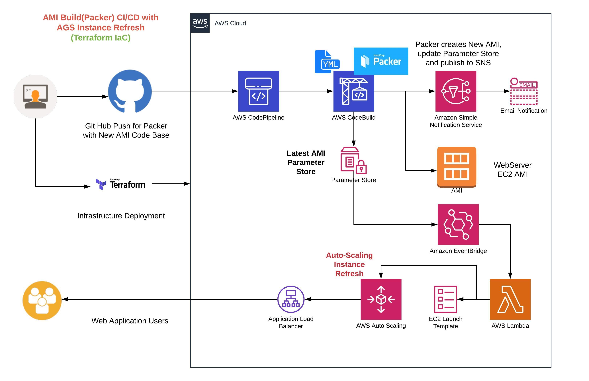

## Packer Image Build and AWS ASG Instance Refresh(Serverless Way)
This project is created to build a serverless CICD pipeline for ASG Instance refresh. We would be using HashiCorp Packer to create AMI and create notification to kick start serverless ASG Instance refresh.

### Pre Setup
Update terraform_iac/inputs.tfvars file with below details
1. Your Repository Name
2. AWS Profile which has access to deploy resources.
3. Git Hub token. It can any secret string.
4. Region
5. Email Ids for notification (Inform of string seperated by ,)
6. OauthToken generated from your Github account.
7. VPC Id
8. A base AMI for intial deployment of ASG. It will be used in Packer as base ami.
9. Key Pair for EC2 instances.

### Run Terraform to deploy Web ASG and serverless setup to automation for ASG instance refresh.
- cd terraform_iac
- terraform init
- terraform plan -var-file="inputs.tfvars"
- terraform apply -var-file="inputs.tfvars"
- note down `Web Server URL` from Terraform Output

### Initiate Image Build CI/CD to new Image build and automated ASG Instance Refresh
- update ami_build_packer/scripts/web_ami_setup.sh script with new version.
- push code into github

`Once code is pushed into GitHub. GitHub Webhook will kick start AWS CodePipeline and AWS CodeBuild will start EC2 AMI creation with Packer. Once AMI Creation is complete, Serverless Lambda will start Autoscaling Group instance refresh without any downtime.`

- Note: If your Codepipeline is failing connect with GitHub then login into AWS and Authenticate Github from Codepipeline source setup screen. 

### Architecture Design

#### Install Packer(Locally for test)
- Learn more: `https://learn.hashicorp.com/tutorials/packer/getting-started-install`
- install `choco install packer`
- Verify: `packer`

#### Run packer to build image(Locally for test)
- cd ami_build_packer
- packer build -var "base_ami=<BASE_AMI_HERE>" images/web_ami_image.json